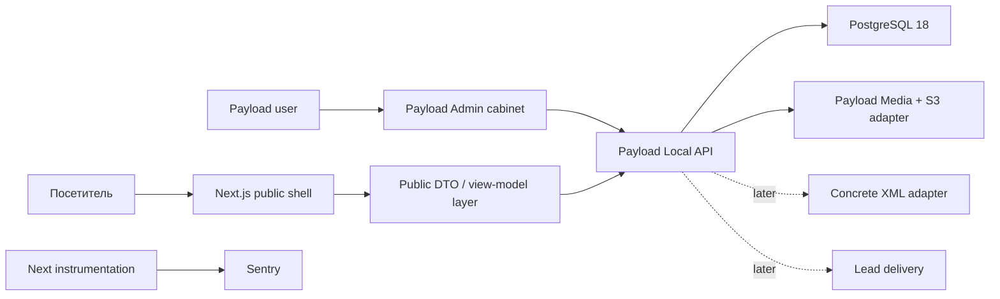

# Architecture

## Deployment model

Одна версия codebase разворачивается отдельно для каждого клиента:

```text
Client deployment
├── Next.js + Payload runtime
├── isolated managed PostgreSQL
├── isolated S3 bucket
├── isolated Doppler config
└── isolated Payload users
```

Multi-tenant shared database не используется. Обновления раскатываются по клиентским контурам последовательно из canonical SourceCraft main на exact SHA.

## Runtime contours



## Payload ownership

Payload остаётся единственной CMS/backend platform:

- auth и sessions;
- collections/globals;
- access control и field access;
- hooks и audit;
- Local API;
- REST/GraphQL;
- migrations;
- generated types/import map;
- PostgreSQL adapter;
- official S3 storage adapter;
- Admin custom views/navigation.

Prisma, Better Auth, второй ORM, repository layer и отдельный admin backend отсутствуют.

## Code layers

- `src/app/(frontend)` — public route families: Home, catalogs, details, commercial pages, employees, journal empty state, legal/sitemap and isolated noindex leadgen shells;
- `src/components/layout`, `src/components/catalog`, `src/components/public` — exact shell/catalog primitives, session collections, content directories and responsive detail templates;
- `src/payload/public/queries.ts` — public Payload DTO/query boundary for properties, complexes, employees, reviews, offices and contacts;
- `src/app/(payload)` — Payload admin/REST/GraphQL и health routes;
- `src/payload/collections` — business schema;
- `src/payload/globals` — globals;
- `src/payload/access` — RBAC/capabilities/append-only policies;
- `src/payload/hooks` — invariants и transactional audit;
- `src/payload/admin/components` — Payload-compatible Admin chrome, responsive mobile header, command menu and shared workspace UI;
- `src/payload/admin/views` — business dashboards, server-filtered tables, metrics and lead kanban;
- `src/payload/admin/queries` — domain-specific server query modules;
- `src/payload/admin/lib/context.ts` — authenticated Payload context и capability guard;
- `src/project/**` — единственный client-specific layer: identity, routes, navigation, theme, content, SEO, media и feed declarations;
- `src/payload/public/**` — public Payload adapters: raw documents → serializable UI DTO;
- `starter.manifest.json` — machine-readable ownership/classification boundary для deterministic export;
- `scripts/verify-backup-restore.mjs` — local restore proof.

## Starter-ready boundary

Текущий repository остаётся production client project Союза и первым consumer будущего full-stack starter. Он не копируется напрямую в новый клиентский repository.

```text
Reusable core
├── components + presentation modules
├── shared DTO/action contracts
├── Payload schema/access/hooks/Admin foundation
├── generic tests and runtime contracts
└── infrastructure shape

Client layer
├── src/project/**
├── client content, legal facts and routes
├── approved media/data/feed mapping
└── domain/server/Doppler/S3 identity

Deterministic export
└── manifest whitelist → neutral client → new migration baseline → clone proof
```

Presentation components do not import Payload documents, Local API, secrets or client identity directly. Routes load data through Payload adapters and pass serializable DTO into page views. Applied migrations, production history and runtime identity Союза remain `UNION_ONLY` and never become neutral starter history.

Canonical contract: `docs/STARTER_CONTRACT.md`. Architectural decision: `docs/adr/ADR-002-full-stack-starter-boundary.md`.

## Query rules

- user-scoped Local API calls use `overrideAccess: false` and explicit `user`;
- raw PostgreSQL aggregation разрешена только внутри server query module после server-side capability guard;
- list pages use `where`, `count`, `sort`, page/limit;
- запрещено загружать тысячи documents и фильтровать их в Node.js;
- business filters/status/date/source fields индексируются;
- public UI не получает raw Payload documents.

## Audit

`admin-activities` — единственный source of truth истории. Hooks пишут audit с тем же `req`, поэтому основная mutation и audit используют transaction context Payload. Operational collections append-only для пользователей.

## Catalog boundary

- `residential-complexes` — самостоятельный public/admin module для первых 30 ЖК;
- `properties` — самостоятельные объявления, вторичка, дома, участки и коммерция;
- future mass feed extension — `ResidentialComplex -> Building -> Unit`;
- committed UI layer contains no foreign client or Astro catalog fixtures; runtime source truth is Payload;
- feed ownership и idempotency зафиксированы отдельно.

## Production extension points

- managed PostgreSQL через `DATABASE_URL`;
- official `@payloadcms/storage-s3` включается при полном наборе S3 variables;
- Sentry включается при наличии DSN/project credentials;
- `/api/health` сообщает database status и release SHA без secrets;
- backup/restore и Payload upgrade profiles имеют отдельные повторяемые команды.
