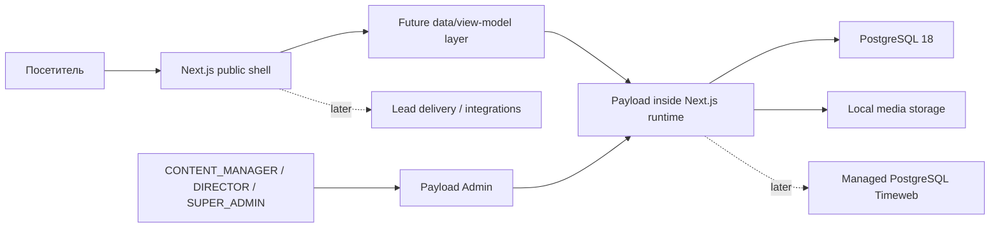

# Architecture

## Контуры

## Подтверждённые границы

- **Public shell:** пока только foundation-заглушка. Полноценный UI и 40 страниц будут добавлены следующим потоком.
- **Payload core:** коллекции `users`, `media`, `pages`, global `site-settings`, hooks, RBAC и admin UI.
- **Data:** `@payloadcms/db-postgres` поверх PostgreSQL 18, schema changes только через Payload migrations.
- **Media:** локальное хранение в `media/` на foundation-этапе с последующим переходом на S3-compatible storage.
- **Integrations:** лиды, импорт объектов, CRM и analytics пока за пределами foundation.
- **Operations:** canonical Git — SourceCraft, целевой runtime-контур — `sz-rostov`, secrets — `szrostov-server/prd`.

## Слои кода

- `src/app/(frontend)` — текущий foundation-shell публичной части;
- `src/app/(payload)` — штатные admin / REST / GraphQL routes Payload;
- `src/payload/collections` — schema collections;
- `src/payload/globals` — globals;
- `src/payload/access` — централизованный RBAC;
- `src/payload/hooks` — локальная нормализация без рекурсивных обновлений;
- `src/payload/admin/components` — ограниченная кастомизация Payload Admin;
- `src/project/config.ts` — минимальная типизированная конфигурация проекта;
- `styles/` — будущая точка входа дизайн-системы.

## Нельзя делать без отдельного решения

- возвращать Prisma или отдельный backend;
- заводить второй auth layer;
- строить бизнес-логику внутри React-компонентов или access functions;
- создавать каталог недвижимости и импорт до отдельного data-contract;
- переносить production домен в рамках foundation.

## Migration boundary

Старый Astro-проект остаётся production source до подтверждённого cutover. Его код не является архитектурным шаблоном нового приложения, но его маршруты, контент, SEO, формы, assets и production-поведение являются обязательными входными данными migration-аудита.

## Extension points

Новые интеграции добавляются через отдельные server modules с явным входным контрактом, валидацией, idempotency и наблюдаемостью. Будущий публичный UI работает через data/query/view-model слой и не обращается напрямую к Payload documents, базе или секретам.
