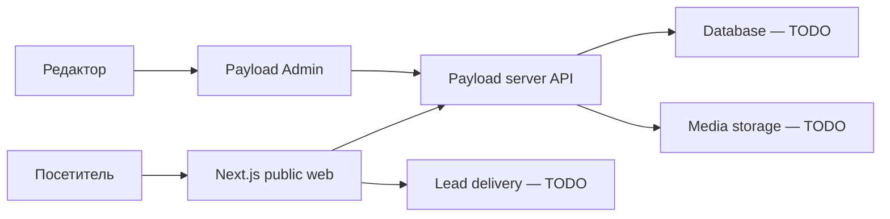

# Architecture

## Статус документа

Каркас архитектуры. Подтверждены только Next.js, Payload CMS, отдельный SourceCraft-репозиторий и серверный контур SZ Rostov. Остальные решения помечены `TODO`.

## Контуры

## Предварительные границы

- **Public web:** публичные маршруты, каталог, SEO, формы и отображение контента.
- **Payload:** коллекции, административная панель, server-side validation, hooks и access control.
- **Data:** выбранная Payload-совместимая база и migrations; конкретный адаптер `TODO`.
- **Media:** загрузка и выдача изображений/документов; способ хранения и резервирования `TODO`.
- **Integrations:** лиды, импорт объектов и внешние API подключаются через явные server-side contracts.
- **Operations:** отдельный runtime на SZ Rostov; Nginx/systemd/container topology и release path `TODO`.

## Решения, которые нельзя принять молча

- монолит Next + Payload или разделённые runtime;
- версия Node.js и package manager;
- database adapter и migration strategy;
- локальная БД и production managed DB;
- media storage, CDN и image processing;
- способ импорта объектов недвижимости;
- auth/RBAC Payload;
- кэширование, revalidation и preview;
- observability, backups и disaster recovery;
- CI/CD и exact-SHA deploy.

## Migration boundary

Старый Astro-проект остаётся production source до подтверждённого cutover. Его код не является архитектурным шаблоном нового приложения, но его маршруты, контент, SEO, формы, assets и production-поведение являются обязательными входными данными migration-аудита.

## Extension points

Новые интеграции добавляются через отдельные server modules с явным входным контрактом, валидацией, idempotency и наблюдаемостью. UI не обращается напрямую к базе или секретам.
